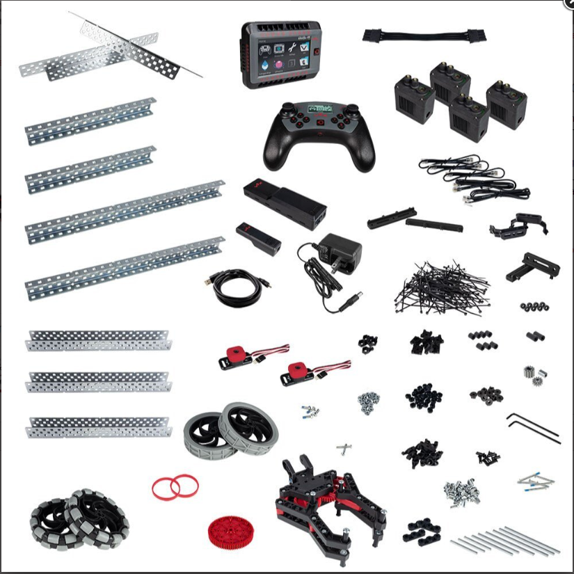

## Vélbúnaður
Hér skal gera töflu eða lista yfir allan búnað sem notaður er gott væri að þið nýttuð ykkur töfluna hér fyrir neðan:

  | Hlutur | Fjöldi | Raftengt | Lýsing |
  | --- | --- | --- | --- |
  | Mótor  | 5 | Já | Knýr hreyfingar | 
  | 10cm dekk  | 2 | nei | Venjulegt dekk |
  | 10cm omni dekk  | 2 | nei | Dekk sem getur hreyfst í allar áttir | 
  | Takki  | 1 | já | takki sem gefur frá sér bool merki |
  | Litaskynjari  | 1 | já | Skynjar liti |
  | Wifi Kubbur  | 1 | já | Gerir okkur kleipt að tengjast vélmenninu gegnum wifi |
  | sonar skynjari | 1 | já | skynjar hluti fyrir framan sig |
  | Line Skynjari  | 3 | já | Skynjar línur undir vélmenninu |
  | Batterí  | 1 | já | Gefur vélmenninu rafmagn |
  | "Robot Brain"  | 1 | já | Tölva aftan á vélmenninu sem helfur utan um allt saman tengt rafmagni |
  | 84T Gír  | 1 | nei | Hlaða/skjóta teygjum |
  | 60T Gír  | 1 | nei | Hallar arminum |
  | 12T Gír  | 2 | nei | Hækkar togkraftinn á stóru gírunum |
  | 11cm Turntable | 1 | já | Snýr arminum |
  | 25cm U-channel  | 2 | nei | Base hliðarnar |
  | 25cm Angle custom  | 2 | nei | endarnir eru sléttir |
  | 12cm C-Channel  | 4 | nei | Arminn |
  | 8cm C-Channel  | 3 | nei | Halda sonar og line sensor |
  | 6cm Angle  | 5 | nei | Botn á arminum |
  | 5cm djúpur U-Channel  | 1 | nei | Heldur skynjurum |
  | 4cm 1/4 hringur  | 2 | nei | Heldur teygjunum |
  | Mislangar beyglaðar stangir   | 3 | nei | Beygðar stangir til þess að halda saman pörtum sem ekki er hægt að festa venjulega  |
  | Misstórar plötur | 2 | nei | Halda pörtum saman |
  | Mótor snúrur  | 6 | já | tengja mótora við "Robot brain" |
  | Skynjarar snúrar | 6 | já | tengja skyndara við "Robo Brain" |
  | Rafmagns snúra  | 1 | já | Tengja batterí við "Robot Brain" |
  | Skrúfur og boltar  | Eins mikið og þarf | nei | festir hluti saman |
  | zip tie  | eins mikið og þarf | nei | MIKILVÆGT!!! Heldur snúrunum og vélmenninu fallegu |
  
  

