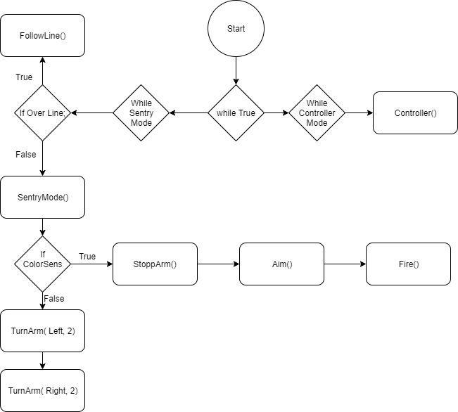

## Verkefnið

Lýsing Vélmennis

  Vélmennið verður á fjögra hjóla ferhyrndum ramma með "snúnings-kubb" í miðjunni. Ofan á þeim kubb verður armur með teygjubyssu og að sjálfsögðu fullt af skönnurum yfir og í kringum allt vélmennið.
   Virknin á vélmenninu er þannig að að hann hefur tvær stillingar: "Controller" og "Sentry"
   
   "Controller" er stillingin þar sem hægt er að stýra vélmenninu með þráðlausari fjarstýringu. Þar getur vélmennið keyrt um, hreyft arminn og skotið teygjum.
   
   "Sentry Mode" er þegar vélmennið þarf ekki stýringu frá fjarstýringu heldur situr vélmennið kyrrt, horfir í kringum sig og sleppir teygjum á allt sem hefur t.d. rauðann lit(með litaskannaranum á arminum).

